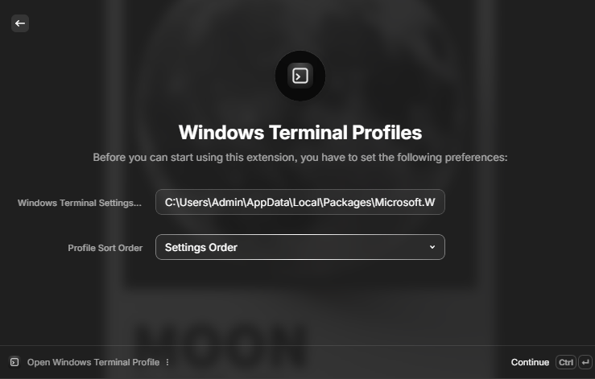
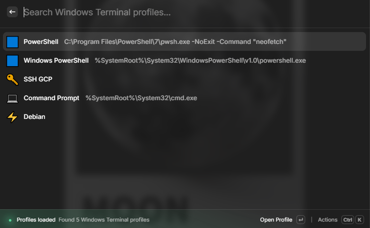

# Raycast - Windows Terminal Profiles

Quick way to open your Terminal Profile easily with Raycast!

# Publishing / Installation

Currently not published to the Raycast Store as the store does not support Windows-only extensions (yet).

You can install it manually by cloning this repository and running `npm ci` then `npm run dev` and it'll be available in your Raycast.

# Tips

- You assign a keyboard shortcut to this to easily open the list of profiles. (personally I use `win + T`)

# Contributing

If you want to contribute, feel free to open an issue or a pull request. Any help is appreciated! (but this repository will probably be moved to the main raycast/extensions repository once publishing is supported)
